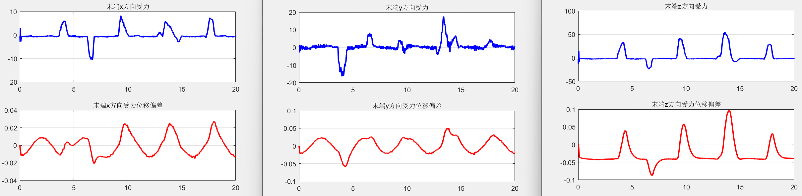
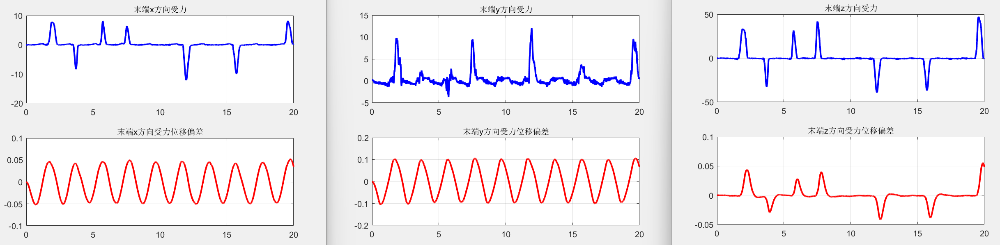
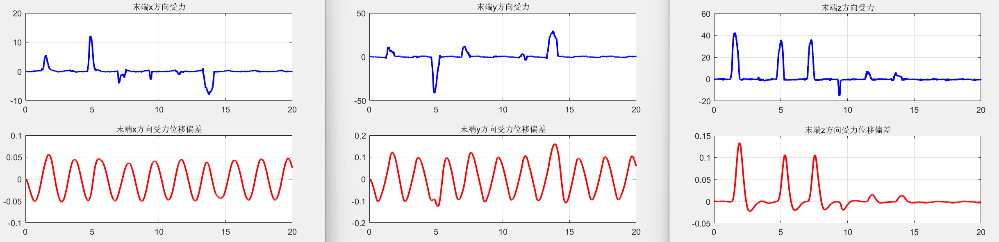

# KUKA机械臂的导纳控制

在近期的实验中，需要根据传感器的给出的实时位置信息进行导纳控制，并实时改变导纳控制的参数。由于KUKA自带的实时导纳控制模型无法实时修改参数，因此尝试了自己实现导纳控制。网上这方面的资料比较少，整理并分享一下自己的思路。

导纳控制的目的在于使得末端的受力和末端的位置两者之间保持一种“平衡”，这种平衡用阻抗模型来一般性表述。
$$F_{ext} = M \ddot{x_e} + B \dot{xe} + K xe;$$
那么，末端收到的外力和末端的轨迹之间的关系为（在受到外力作用下，使得轨迹产生了多大的偏差）：
$$\ddot{x_e} =M^{-1} * (F_{ext} - B \dot{xe} - K xe); $$
$$\dot{x_e} = \dot{x_e} + \ddot{x_e} * \Delta T;$$
$${x_e} = {x_e} + \dot{x_e} * \Delta T;$$
进一步的，就可以在原来规划的轨迹上更新，得到新的期望轨迹：
$$\dot{x_{tar}} = \dot{x_0} + \dot{x_e};$$

$$x_{tar} = {x_0} + {x_e};$$

一般情况下，导纳控制器根据规划好的轨迹（加速度、速度、位置）和测量得到的外力基础上进行控制。在本实验中，传感器估计得到的只有腕关节的角度，只能将其作为末端位置 或 末端速度。

## 基于位置轨迹的导纳控制

在基于位置轨迹的导纳控制中，如果按照原来的阻抗模型，则需要对位置求微分得到速度，在实际人机交互的实验中，人腕关节的移动可能会比较快，那么微分求得的速度很容易超过安全限速。因此，考虑简化阻抗模型为
$$F_{ext} = B \dot{xe} + K xe;$$

这样一来，式子中就没有了速度项，就可以完全根据位置轨迹进行导纳控制。

外力使轨迹产生的偏差：
$$\dot{x_e} =B^{-1} * (F_{ext} - K xe);$$
$${x_e} = {x_e} + \dot{x_e} * \Delta T;$$

新的位置轨迹为：
$$x_{tar} = {x_0} + {x_e};$$
这样的话，就处理好了位置和外力之间的关系，接下里的任务则是对KUKA的位置环的控制，利用kuka实现的位置伺服控制API即可，外力的求解和距离控制流程详见代码。

实机实验的结果：

- 高导纳系数（受外力影响大）

- 低导纳系数（受外力影响小）

## 基于速度轨迹的导纳控制

在完成基于位置的导纳控制之后，发现控制效果并不够顺滑，而且把传感器的输出当作位置轨迹，对传感器精度要求较高，如果把传感器的输出映射为速度轨迹，那么整体的控制效果应该会好一些。

既然得到了末端的速度轨迹，那么其实也就可以直接利用一般性的阻抗模型进行控制了，只不过这里的被控量是速度，需要计算出关节速度发送给KUKA，具体流程见代码。

实机实验的结果：

- 高导纳系数（受外力影响大）

- 低导纳系数（受外力影响小）

